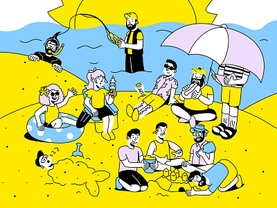

# CSS-Advanced
#### index.html
```
<!DOCTYPE html>
<html lang="en">
<head>
    <meta charset="UTF-8">
    <meta name="viewport" content="width=device-width, initial-scale=1.0">
    <title>Dribbble Clone</title>
    <link rel="stylesheet" href="style.css">
</head>
<body>
    <header>
        <nav>
            <div class="logo">Dribbble</div>
            <ul class="nav-links">
                <li><a href="#">Inspiration</a></li>
                <li><a href="#">Find Work</a></li>
                <li><a href="#">Learn Design</a></li>
                <li><a href="#">Go Pro</a></li>
                <li><a href="#">Hire Designers</a></li>
            </ul>
            <div class="auth-buttons">
                <button class="login">Log in</button>
                <button class="sign-up">Sign up</button>
            </div>
        </nav>
    </header>
    <main>
        <section class="hero">
            <h1>Discover the world’s top designers & creatives</h1>
            <p>Dribbble is the leading destination to find & showcase creative work and home to the world's best design professionals.</p>
            <button class="cta-button">Explore Now</button>
        </section>
        <section class="gallery-container">
            <div class="gallery">
                <div class="gallery-item"></div>
                <div class="gallery-item"></div>
                <div class="gallery-item"></div>
                <div class="gallery-item"></div>
                <div class="gallery-item"></div>
                <div class="gallery-item"></div>
            </div>
        </section>
    </main>
    <footer>
        <p>© 2025 Dribbble. All rights reserved.</p>
    </footer>
    <script src="script.js"></script>
</body>
</html>
```
## style.css
```
body {
    font-family: Arial, sans-serif;
    margin: 0;
    padding: 0;
    box-sizing: border-box;
    overflow-x: hidden;
}

header {
    background-color: transparent;
    border-bottom: 1px solid #ddd;
    padding: 20px 0;
    position: fixed;
    width: 100%;
    top: 0;
    z-index: 1000;
    transition: background-color 0.3s;
}

nav {
    display: flex;
    justify-content: space-between;
    align-items: center;
    max-width: 1200px;
    margin: 0 auto;
    padding: 0 20px;
}
.logo {
    font-size: 24px;
    font-weight: bold;
}

.nav-links {
    list-style: none;
    display: flex;
    gap: 20px;
}

.nav-links li {
    display: inline;
}

.nav-links a {
    text-decoration: none;
    color: #333;
    transition: color 0.3s;
}

.nav-links a:hover {
    color: #15ef1f;
}

.auth-buttons button {
    margin-left: 10px;
    padding: 10px 20px;
    border: none;
    border-radius: 5px;
    cursor: pointer;
    transition: background-color 0.3s, color 0.3s;
}
.auth-buttons .login {
    background-color: #f3f3f3;
}

.auth-buttons .sign-up {
    background-color: #1feb22;
    color: #fff;
}

.auth-buttons .login:hover {
    background-color: #ddd;
}

.auth-buttons .sign-up:hover {
    background-color: #28f50c;
}

.hero {
    text-align: center;
    padding: 150px 20px;
    background-color: #f5f5f5;
    transition: background-color 0.5s;
}

.hero h1 {
    font-size: 36px;
    margin-bottom: 20px;
    animation: fadeIn 2s ease-in-out;
}

.hero p {
    font-size: 18px;
    color: #666;
    animation: fadeIn 2s ease-in-out 0.5s;
}
.cta-button {
    padding: 15px 30px;
    background-color: #09e42a;
    color: #fff;
    border: none;
    border-radius: 5px;
    cursor: pointer;
    font-size: 16px;
    margin-top: 20px;
    transition: background-color 0.3s, transform 0.3s;
}

.cta-button:hover {
    background-color: #46ee20;
    transform: scale(1.05);
}

.gallery-container {
    overflow: hidden;
    white-space: nowrap;
}

.gallery {
    display: flex;
    animation: scroll 20s linear infinite;
}
.gallery-item {
    display: inline-block;
    padding: 0 1
    
    
    0px;
}

.gallery-item img {
    width: 100%;
    height: auto;
    display: block;
    border-radius: 10px;
}

footer {
    text-align: center;
    padding: 20px;
    background-color: #fff;
    border-top: 1px solid #ddd;
    transition: background-color 0.5s;
}

footer p {
    margin: 0;
    color: #666;
}
@keyframes fadeIn {
    from {
        opacity: 0;
    }
    to {
        opacity: 1;
    }
}

@keyframes scroll {
    from {
        transform: translateX(0);
    }
    to {
        transform: translateX(-50%);
    }
}
```
## Output


